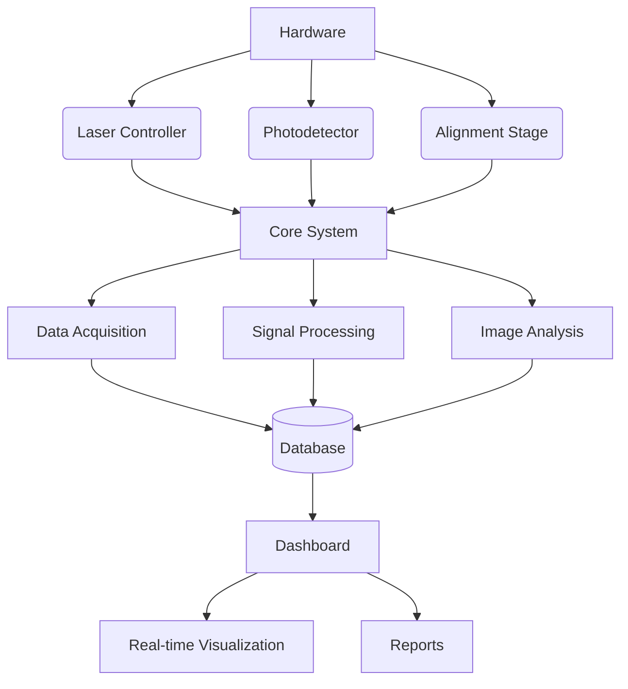
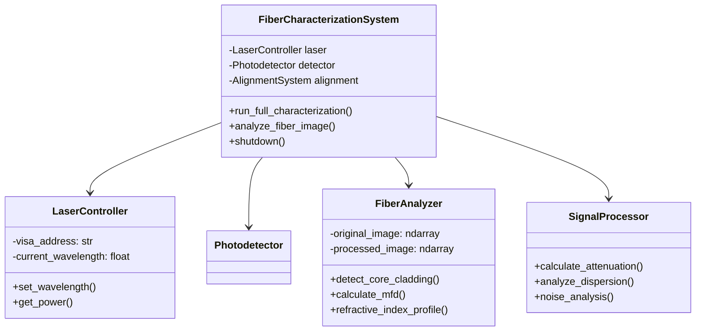
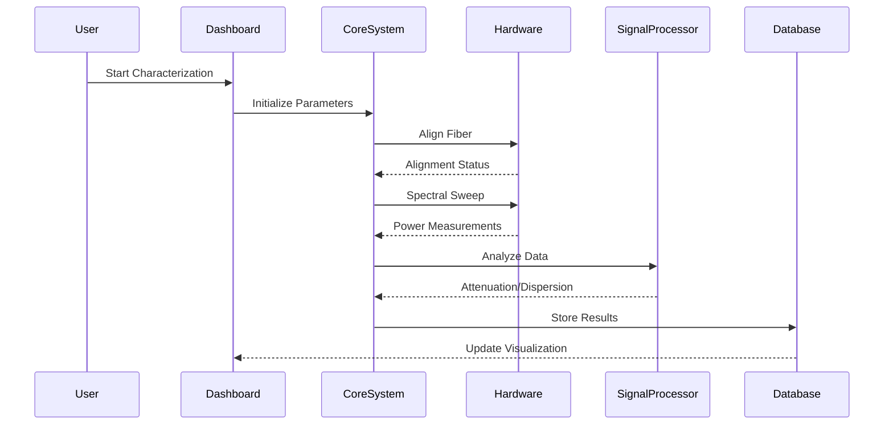
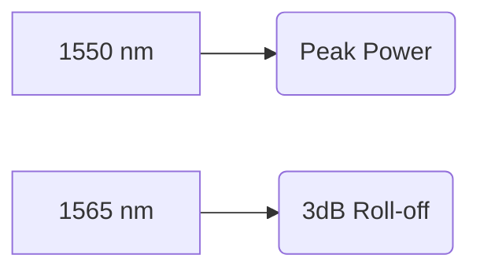
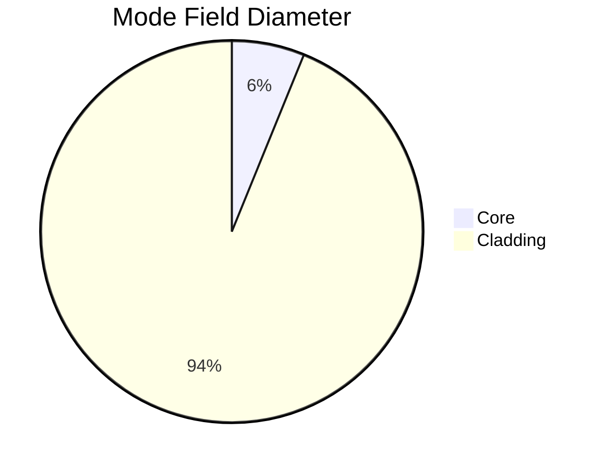
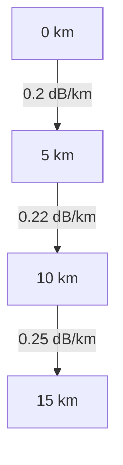

# Automated Optical Fiber Characterization System

A system for automated characterization of optical fibers, measuring attenuation, dispersion, refractive index, and geometric parameters through integrated hardware control and Image analysis.

## Table of Contents
1. [System Architecture](#system-architecture)
2. [Key Features](#key-features)
3. [Class Diagram](#class-diagram)
4. [Data Flow](#data-flow)
5. [Installation](#installation)
6. [Configuration](#configuration)
7. [Usage](#usage)
8. [Results](#results)

----
### Demo & Screenshots


<video src="https://github.com/user-attachments/assets/c9e06946-06a4-46e9-a20b-86371c6b175e" title="Demo video"></video>

----
## System Architecture



## Key Features

- **Multi-parameter Measurement**
- **Automated Fiber Alignment**
- **Real-time Spectral Analysis**
- **AI-powered Defect Detection**
- **Professional Reporting**

## Class Diagram



## Data Flow



## Installation

### Requirements
- Python 3.9+
- NI-VISA Drivers
- OpenCV with Contrib Modules

```bash
git clone https://github.com/FakeCoder01/fiber-characterization-system.git
cd fiber-characterization-system
pip install -r requirements.txt
```

## Configuration

Edit `src/config/config.yaml`:
```yaml
hardware:
  laser:
    visa_address: GPIB0::12::INSTR
    min_wavelength: 1500
    max_wavelength: 1600
  detector:
    visa_address: GPIB0::15::INSTR

acquisition:
  interval: 0.1  # seconds
  sampling_rate: 1000  # Hz

analysis:
  core_threshold: 0.7
  cladding_threshold: 0.3
```

## Usage


### Dashboard
```bash
cd src/
python app.py
```
#### Serer started at : `http://localhost:8050`
------


## Results

### Typical Outputs

**Spectral Response**


**MFD Measurement**


**Attenuation Curve**


## Troubleshooting

| Issue | Solution |
|-------|----------|
| Hardware Connection Failed | Check VISA addresses and cables |
| Image Analysis Failure | Verify fiber is centered in image |
| Signal Noise Too High | Clean connectors, check laser stability |
